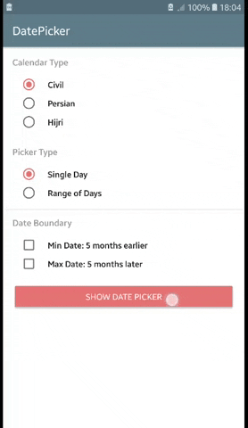
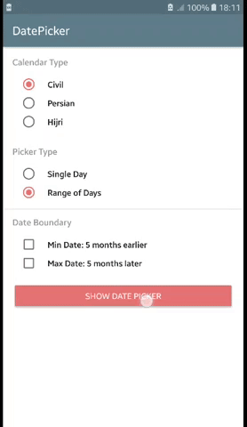
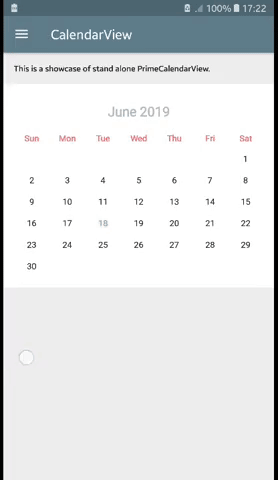
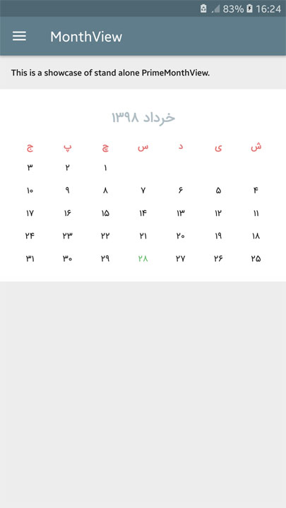
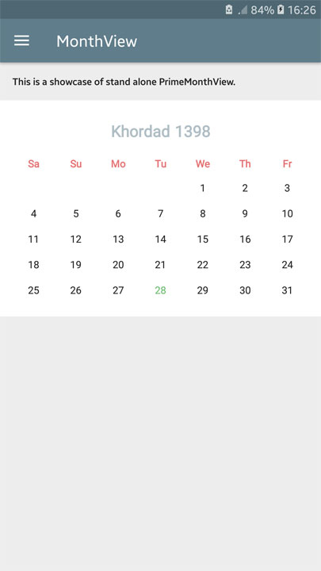
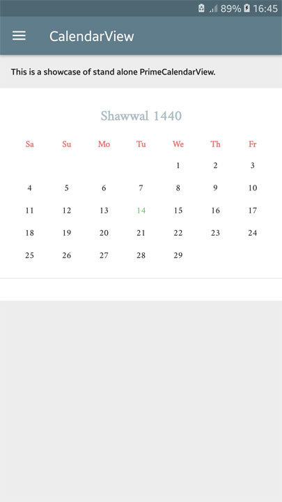

# `PrimeDatePicker` :zap:
[](https://android-arsenal.com/details/1/7743)
[](http://androidweekly.net/issues/issue-367)
[ ](https://bintray.com/aminography/maven/PrimeDatePicker/_latestVersion)
  
First, **`PrimeDatePicker`** is a tool which provides picking a single day as well as a range of days. Second, you can use its `MonthView` and `CalendarView` as stand-alone views in your projects.


| Picking a Single Day | Picking a Range of Days | Fling Orientations |
| --- | --- | --- |
|  |  |  | 

<br/>

Download
--------
**`PrimeDatePicker`** is available on [bintray](https://bintray.com/aminography/maven/PrimeDatePicker) to download using build tools systems. Add the following lines to your `build.gradle` file:

```gradle
repositories {
    jcenter()
}
  
dependencies {
    implementation 'com.aminography:primedatepicker:1.0.11'
    implementation 'com.aminography:primecalendar:1.2.13'
}
```

<br/>

Usage
-----------------
To use `PrimeDatePickerBottomSheet`, simply use below snippet:

> Kotlin
```kotlin
val datePicker = PrimeDatePickerBottomSheet.newInstance(
            currentDateCalendar,
            pickType,
            pickedSingleDayCalendar, // can be null
            pickedRangeStartCalendar, // can be null
            pickedRangeEndCalendar, // can be null
            minDateCalendar, // can be null
            maxDateCalendar, // can be null
            typefacePath // can be null
    )

datePicker.setOnDateSetListener(object : PrimeDatePickerBottomSheet.OnDayPickedListener {

    override fun onSingleDayPicked(singleDay: PrimeCalendar) {
        // TODO
    }

    override fun onRangeDaysPicked(startDay: PrimeCalendar, endDay: PrimeCalendar) {
        // TODO
    }
})

datePicker.show(supportFragmentManager)
```

<br/>

> Java
```java
PrimeDatePickerBottomSheet datePicker = PrimeDatePickerBottomSheet.newInstance(
        currentDateCalendar, // for example: new PersianCalendar()
        pickType // for example: PickType.SINGLE
);

datePicker.setOnDateSetListener(new PrimeDatePickerBottomSheet.OnDayPickedListener() {

    @Override
    public void onSingleDayPicked(@NotNull PrimeCalendar singleDay) {
        // TODO
    }

    @Override
    public void onRangeDaysPicked(@NotNull PrimeCalendar startDay, @NotNull PrimeCalendar endDay) {
        // TODO
    }
});

datePicker.show(getSupportFragmentManager());
```

<br/>

Stand-Alone Views
-----------------
In addition to use **`PrimeDatePicker`** as a date picker tool, it is possible to employ stand-alone views in your project. 
They are `PrimeMonthView` & `PrimeCalendarView` which can be used in layout `xml` files or instantiated programmatically.
For example:

> xml
```xml
<com.aminography.primedatepicker.monthview.PrimeMonthView
    android:id="@+id/monthView"
    android:layout_width="match_parent"
    android:layout_height="wrap_content"
    android:padding="16dp" />
```

> Programmatically
```kotlin
val monthView = PrimeMonthView(context)
```

<br/>

### 1. XML Attributes
Applying customization has been provided for `PrimeMonthView` and `PrimeCalendarView` by using `xml` attributes as well as setting them programmatically.
For example:

> xml
```xml
<com.aminography.primedatepicker.calendarview.PrimeCalendarView
    android:id="@+id/calendarView"
    android:layout_width="match_parent"
    android:layout_height="wrap_content"
    app:pickedDayCircleColor="#0000FF" />
```

> Programmatically
```kotlin
calendarView.pickedDayCircleColor = Color.BLUE
```

<br/>

### 1.1. Common attributes for `PrimeMonthView` & `PrimeCalendarView`:

<table>

  <tr>
    <td><b>Attribute</b></td>
    <td><b>Type</b></td>
  </tr>
  
  <tr>
    <td><b>• calendarType</b></td>
    <td>enum</td>
  </tr>
  <tr>
    <td colspan="2"><i>Specifies the calendar type which is shown by this view. Its possible values are: <b>civil</b>, <b>persian</b>, <b>hijri</b>, and <b>japanese</b>.</i></td>
  </tr>
  
  <tr>
    <td><b>• monthLabelTextColor</b></td>
    <td>color</td>
  </tr>
  <tr>
    <td colspan="2"><i>Specifies the text color of month name label.</i></td>
  </tr>
  
  <tr>
    <td><b>• weekLabelTextColor</b></td>
    <td>color</td>
  </tr>
  <tr>
    <td colspan="2"><i>Specifies the text color of week day name labels.</i></td>
  </tr>
  
  <tr>
    <td><b>• dayLabelTextColor</b></td>
    <td>color</td>
  </tr>
  <tr>
    <td colspan="2"><i>Specifies the text color of day number labels.</i></td>
  </tr>
  
  <tr>
    <td><b>• todayLabelTextColor</b></td>
    <td>color</td>
  </tr>
  <tr>
    <td colspan="2"><i>Specifies the text color of day number label which belongs to today.</i></td>
  </tr>
  
  <tr>
    <td><b>• pickedDayLabelTextColor</b></td>
    <td>color</td>
  </tr>
  <tr>
    <td colspan="2"><i>Specifies the text color of day number labels when they are picked.</i></td>
  </tr>
  
  <tr>
    <td><b>• pickedDayCircleColor</b></td>
    <td>color</td>
  </tr>
  <tr>
    <td colspan="2"><i>Specifies the background color of day numbers when they are picked.</i></td>
  </tr>
  
  <tr>
    <td><b>• disabledDayLabelTextColor</b></td>
    <td>color</td>
  </tr>
  <tr>
    <td colspan="2"><i>Specifies the text color of day number labels when they are disabled.</i></td>
  </tr>
  
  <tr>
    <td><b>• monthLabelTextSize</b></td>
    <td>dimension</td>
  </tr>
  <tr>
    <td colspan="2"><i>Specifies the text size of month name label.</i></td>
  </tr>
  
  <tr>
    <td><b>• weekLabelTextSize</b></td>
    <td>dimension</td>
  </tr>
  <tr>
    <td colspan="2"><i>Specifies the text size of week day name labels.</i></td>
  </tr>
  
  <tr>
    <td><b>• dayLabelTextSize</b></td>
    <td>dimension</td>
  </tr>
  <tr>
    <td colspan="2"><i>Specifies the text size of day number labels.</i></td>
  </tr>
  
  <tr>
    <td><b>• monthLabelTopPadding</b></td>
    <td>dimension</td>
  </tr>
  <tr>
    <td colspan="2"><i>Specifies the top padding of month name label.</i></td>
  </tr>
  
  <tr>
    <td><b>• monthLabelBottomPadding</b></td>
    <td>dimension</td>
  </tr>
  <tr>
    <td colspan="2"><i>Specifies the bottom padding of month name label.</i></td>
  </tr>
  
  <tr>
    <td><b>• weekLabelTopPadding</b></td>
    <td>dimension</td>
  </tr>
  <tr>
    <td colspan="2"><i>Specifies the top padding of week day name labels.</i></td>
  </tr>
  
  <tr>
    <td><b>• weekLabelBottomPadding</b></td>
    <td>dimension</td>
  </tr>
  <tr>
    <td colspan="2"><i>Specifies the bottom padding of week day name labels.</i></td>
  </tr>
  
  <tr>
    <td><b>• dayLabelVerticalPadding</b></td>
    <td>dimension</td>
  </tr>
  <tr>
    <td colspan="2"><i>Specifies the vertical padding (top and bottom) of day number labels.</i></td>
  </tr>
  
  <tr>
    <td><b>• showTwoWeeksInLandscape</b></td>
    <td>boolean</td>
  </tr>
  <tr>
    <td colspan="2"><i>When it sets <b>true</b>, month view shows two weeks (14 days) in each row for landscape screen orientation.</i></td>
  </tr>
  
</table>

<br/>

### 1.2. `PrimeCalendarView` Specific Attributes:

<table>

  <tr>
    <td><b>Attribute</b></td>
    <td><b>Type</b></td>
  </tr>
  
  <tr>
    <td><b>• flingOrientation</b></td>
    <td>enum</td>
  </tr>
  <tr>
    <td colspan="2"><i>Specifies the fling orientation of calendar view. Its possible values are: <b>vertical</b>, <b>horizontal</b>.</i></td>
  </tr>
  
  <tr>
    <td><b>• dividerColor</b></td>
    <td>color</td>
  </tr>
  <tr>
    <td colspan="2"><i>Specifies the color of divider lines separating month views.</i></td>
  </tr>
  
  <tr>
    <td><b>• dividerThickness</b></td>
    <td>dimension</td>
  </tr>
  <tr>
    <td colspan="2"><i>Specifies the thickness of divider lines separating month views.</i></td>
  </tr>
  
  <tr>
    <td><b>• dividerInsetLeft</b></td>
    <td>dimension</td>
  </tr>
  <tr>
    <td colspan="2"><i>Specifies the left margin of divider lines when the fling orientation is vertical.</i></td>
  </tr>
  
  <tr>
    <td><b>• dividerInsetRight</b></td>
    <td>dimension</td>
  </tr>
  <tr>
    <td colspan="2"><i>Specifies the right margin of divider lines when the fling orientation is vertical.</i></td>
  </tr>
  
  <tr>
    <td><b>• dividerInsetTop</b></td>
    <td>dimension</td>
  </tr>
  <tr>
    <td colspan="2"><i>Specifies the top margin of divider lines when the fling orientation is horizontal.</i></td>
  </tr>
  
  <tr>
    <td><b>• dividerInsetBottom</b></td>
    <td>dimension</td>
  </tr>
  <tr>
    <td colspan="2"><i>Specifies the bottom margin of divider lines when the fling orientation is horizontal.</i></td>
  </tr>
  
  <tr>
    <td><b>• loadFactor</b></td>
    <td>integer</td>
  </tr>
  <tr>
    <td colspan="2"><i>Specifies the number of month to be load in pagination (endless scrolling).</i></td>
  </tr>
  
  <tr>
    <td><b>• maxTransitionLength</b></td>
    <td>integer</td>
  </tr>
  <tr>
    <td colspan="2"><i>Specifies the maximum number of month that are shown between current and target in transitions. It's used when <b>goto</b> method has called.</i></td>
  </tr>
  
  <tr>
    <td><b>• transitionSpeedFactor</b></td>
    <td>float</td>
  </tr>
  <tr>
    <td colspan="2"><i>Specifies the speed factor of scrolling in transitions. It's used when <b>goto</b> method has called.</i></td>
  </tr>
  
</table>

<br/>

### 2. Other Variables (Common for `PrimeMonthView` & `PrimeCalendarView`)
These variables are only accessible programmatically to get or set. (Available by getter and setter methods in java)

<table>

  <tr>
    <td><b>Variable</b></td>
    <td><b>Type</b></td>
  </tr>
  
  <tr>
    <td><b>• typeface</b></td>
    <td>Typeface</td>
  </tr>
  <tr>
    <td colspan="2"><i>Specifies the typeface of showing texts.</i></td>
  </tr>
  
  <tr>
    <td><b>• pickedSingleDayCalendar</b></td>
    <td>PrimeCalendar</td>
  </tr>
  <tr>
    <td colspan="2"><i>Specifies the single picked date.</i></td>
  </tr>
  
  <tr>
    <td><b>• pickedRangeStartCalendar</b></td>
    <td>PrimeCalendar</td>
  </tr>
  <tr>
    <td colspan="2"><i>Specifies the start date of the picked range.</i></td>
  </tr>
  
  <tr>
    <td><b>• pickedRangeEndCalendar</b></td>
    <td>PrimeCalendar</td>
  </tr>
  <tr>
    <td colspan="2"><i>Specifies the end date of the picked range.</i></td>
  </tr>
  
  <tr>
    <td><b>• minDateCalendar</b></td>
    <td>PrimeCalendar</td>
  </tr>
  <tr>
    <td colspan="2"><i>Specifies the minimum feasible date of the view.</i></td>
  </tr>
  
  <tr>
    <td><b>• maxDateCalendar</b></td>
    <td>PrimeCalendar</td>
  </tr>
  <tr>
    <td colspan="2"><i>Specifies the maximum feasible date of the view.</i></td>
  </tr>
  
  <tr>
    <td><b>• pickType</b></td>
    <td><a href="https://github.com/aminography/PrimeDatePicker/blob/master/library/src/main/java/com/aminography/primedatepicker/PickType.kt">PickType</a></td>
  </tr>
  <tr>
    <td colspan="2"><i>Specifies the date picking type of the view. Its possible values are: <b>SINGLE</b>, <b>RANGE_START</b>, <b>RANGE_END</b>, <b>NOTHING</b>.</i></td>
  </tr>

</table>

<br/>

### 3. Listener (Common for `PrimeMonthView` & `PrimeCalendarView`)
You can listen to day picking actions by setting an instance of [OnDayPickedListener](https://github.com/aminography/PrimeDatePicker/blob/master/library/src/main/java/com/aminography/primedatepicker/OnDayPickedListener.kt) to the views.
For example:

```kotlin
monthView.onDayPickedListener = object : OnDayPickedListener {

    override fun onDayPicked(pickType: PickType, 
                             singleDay: PrimeCalendar?, 
                             startDay: PrimeCalendar?, 
                             endDay: PrimeCalendar?) {
        // TODO
    }
}
```

<br/>

Locale
-------------------------------------------
`PrimeMonthView` and `PrimeCalendarView` (consequently `PrimeDatePickerBottomSheet`) have been implemented with localization capabilities. 
By choosing locale for the `PrimeCalendar` instance which is passed to `goto` method, or by setting it directly to the views, you can  localize names, digits, and layout direction.

#### Localization example for `PrimeMonthView` using `PersianCalendar`:

<br/>

<table>

  <tr>
    <td><b>monthView.goto(PersianCalendar())</b><br/><i>// or</i><br/><b>monthView.locale = Locale("fa")</b></td>
    <td><b>monthView.goto(PersianCalendar(Locale.ENGLISH))</b><br/><i>// or</i><br/><b>monthView.locale = Locale.ENGLISH</b></td>
  </tr>

  <tr>
    <td></td>
    <td></td>
  </tr>

</table>

<br/>

#### Localization example for `PrimeCalendarView` using `HijriCalendar`:

<br/>

<table>

  <tr>
    <td><b>calendarView.goto(HijriCalendar())</b><br/><i>// or</i><br/><b>calendarView.locale = Locale("ar")</b></td>
    <td><b>calendarView.goto(HijriCalendar(Locale.ENGLISH))</b><br/><i>// or</i><br/><b>calendarView.locale = Locale.ENGLISH</b></td>
  </tr>

  <tr>
    <td></td>
    <td></td>
  </tr>

</table>

<br/>

Customizing Texts in Date Picker Bottom Sheet
-------------------------------------------
If you want to change the texts of the date picker bottom sheet, define some strings in your project's `strings.xml` with equal name defined in the library's [`strings.xml`](https://github.com/aminography/PrimeDatePicker/blob/master/library/src/main/res/values/strings.xml), to override them.

<br/>

Third-Party Libraries
---------------------
**• PrimeCalendar** (https://github.com/aminography/PrimeCalendar)

**• PrimeAdapter** (https://github.com/aminography/PrimeAdapter)

<br/>

License
--------
```
Copyright 2019 Mohammad Amin Hassani.

Licensed under the Apache License, Version 2.0 (the "License");
you may not use this file except in compliance with the License.
You may obtain a copy of the License at

   http://www.apache.org/licenses/LICENSE-2.0

Unless required by applicable law or agreed to in writing, software
distributed under the License is distributed on an "AS IS" BASIS,
WITHOUT WARRANTIES OR CONDITIONS OF ANY KIND, either express or implied.
See the License for the specific language governing permissions and
limitations under the License.
```
