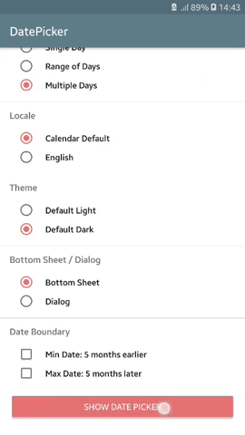
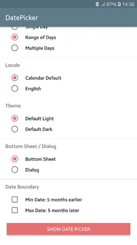
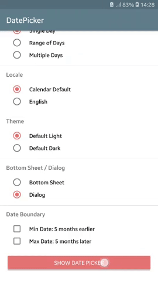
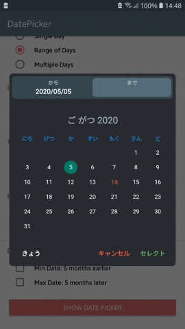
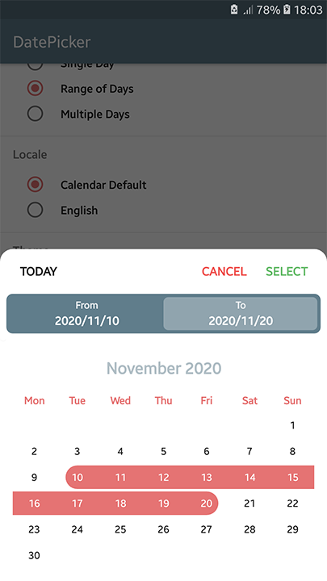
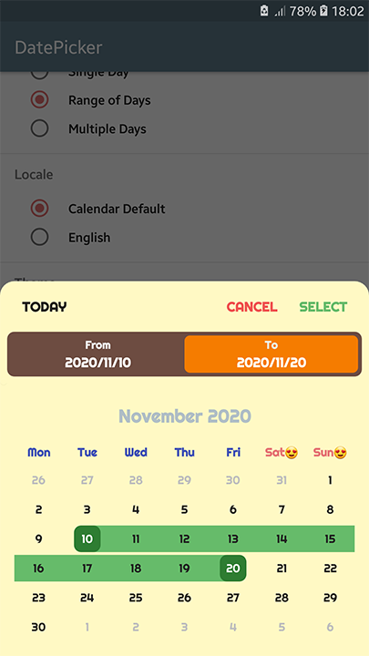

# `PrimeDatePicker` :zap:
[](https://android-arsenal.com/details/1/7743)
[](http://androidweekly.net/issues/issue-367)

[](https://app.codacy.com/manual/aminography/PrimeDatePicker?utm_source=github.com&utm_medium=referral&utm_content=aminography/PrimeDatePicker&utm_campaign=Badge_Grade_Dashboard)
[](https://android-arsenal.com/api?level=13)

Firstly, **`PrimeDatePicker`** is a tool that provides picking a single day, multiple days, and a range of days. Secondly, you can use internal elements like `MonthView` and `CalendarView` as stand-alone views in your projects.


<table>

  <tr>
    <td><b>Multiple Days | Civil</b><br/><i>BottomSheet | Dark</i></td>
    <td><b>Range of Days | Persian</b><br/><i>BottomSheet | Light</i></td>
    <td><b>Single Day | Hijri</b><br/><i>Dialog | Light</i></td>
    <td><b>Goto Feature | Japanese</b><br/><i>Dialog | Dark</i></td>
  </tr>

  <tr>
    <td></td>
    <td></td>
    <td></td>
    <td></td>
  </tr>

</table>

<br/>

Table of Contents
-----------------

- [Core Logic](#core-logic)
- [Main Characteristics](#main-characteristics)
- [Download](#download)
- [Usage](#usage)
   - [Java Example](#java-example)
   - [Builder Configurations](#builder-configurations)
   - [Input Calendar Configurations](#input-calendar-configurations)
- [Customizing Theme](#customizing-theme)
   - [Customizing Texts](#customizing-texts)
- [Stand-Alone Views](#stand-alone-views)
- [Change Log](#change-log)

<br/>

Core Logic
----------
The ❤️ of this library is provided by [**PrimeCalendar**](https://github.com/aminography/PrimeCalendar).

<br/>

Main Characteristics
--------------------
- Endless Scrolling
- Fully Customizable Views & Themes
- Align With Material Design
- Fluent UI
- RTL Support
- Landscape Support
- Various Calendar Types
- Various Date Picking Strategies
- Dialog & BottomSheet Presentations
- Fast Goto

#### :dart: Download [SampleApp.apk](https://github.com/aminography/PrimeDatePicker/releases/download/v3.4.0/sample-app-release.apk)

<br/>

Download
--------
**`PrimeDatePicker`** is available on `MavenCentral` to download using build tools systems. Add the following lines to your `build.gradle` file:

```gradle
dependencies {
    implementation 'com.aminography:primedatepicker:3.6.0'
    implementation 'com.aminography:primecalendar:1.7.0'
}
```

<br/>

Usage
-----

To enjoy `PrimeDatePicker`, create an instance using a builder pattern in simple 4 steps.

1. Decide on **BottomSheet** or **Dialog** representation along with an initial calendar:
```kotlin
// To show a date picker with Civil dates, also today as the starting date
val today = CivilCalendar()

val datePicker = PrimeDatePicker.bottomSheetWith(today)  // or dialogWith(today)
```

2. Decide on picking strategy along with passing a proper callback:
```kotlin
val callback = SingleDayPickCallback { day ->
    // TODO
}

val today = CivilCalendar()

val datePicker = PrimeDatePicker.bottomSheetWith(today)
        .pickSingleDay(callback)  // or pickRangeDays(callback) or pickMultipleDays(callback)
```

3. Apply some optional configurations:

```kotlin
...

val datePicker = PrimeDatePicker.bottomSheetWith(today)
        .pickSingleDay(callback)
        .initiallyPickedSingleDay(pickedDay)
        ...
```

4. Build the date picker and show it:
```kotlin
val callback = SingleDayPickCallback { day ->
    // TODO
}

val today = CivilCalendar()

val datePicker = PrimeDatePicker.bottomSheetWith(today)
        .pickSingleDay(callback)
        .initiallyPickedSingleDay(pickedDay)
        .build()
        
datePicker.show(supportFragmentManager, "SOME_TAG")
```

<br/>

### Java Example

> Java
```java
SingleDayPickCallback callback = new SingleDayPickCallback() {
    @Override
    public void onSingleDayPicked(PrimeCalendar singleDay) {
        // TODO
    }
};

// To show a date picker with Japanese dates, also today as the starting date
PrimeCalendar today = new JapaneseCalendar();  

PrimeDatePicker datePicker = PrimeDatePicker.Companion.dialogWith(today)
    .pickSingleDay(callback)
    .build();

datePicker.show(getSupportFragmentManager(), "SOME_TAG");
```

<br/>

### Builder Configurations

There are several builder functions applying relevant configurations on the date picker.

<br/>

<table>

  <tr>
    <td><b>Function</b></td>
    <td><b>Picking Strategy</b></td>
  </tr>

  <tr>
    <td><b>• minPossibleDate(minDate: PrimeCalendar)</b></td>
    <td>ALL</td>
  </tr>
  <tr>
    <td colspan="2"><i>Specifies the minimum feasible date to be shown in date picker, which is selectable.</i></td>
  </tr>

  <tr>
    <td><b>• maxPossibleDate(maxDate: PrimeCalendar)</b></td>
    <td>ALL</td>
  </tr>
  <tr>
    <td colspan="2"><i>Specifies the maximum feasible date to be shown in date picker, which is selectable.</i></td>
  </tr>

  <tr>
    <td><b>• firstDayOfWeek(firstDayOfWeek: Int)</b></td>
    <td>ALL</td>
  </tr>
  <tr>
    <td colspan="2"><i>Specifies the day that should be considered as the start of the week. Possible values are: Calendar.SUNDAY, Calendar.MONDAY, etc.</i></td>
  </tr>

  <tr>
    <td><b>• disabledDays(disabledDays: List&lt;PrimeCalendar&gt;)</b></td>
    <td>ALL</td>
  </tr>
  <tr>
    <td colspan="2"><i>Specifies the list of disabled days, which aren't selectable.</i></td>
  </tr>

  <tr>
    <td><b>• applyTheme(themeFactory: ThemeFactory)</b></td>
    <td>ALL</td>
  </tr>
  <tr>
    <td colspan="2"><i>Specifies the theme.</i></td>
  </tr>

  <tr>
    <td><b>• initiallyPickedSingleDay(pickedDay: PrimeCalendar)</b></td>
    <td>SingleDay</td>
  </tr>
  <tr>
    <td colspan="2"><i>Specifies initially picked day when the date picker has just shown.</i></td>
  </tr>

  <tr>
    <td><b>• initiallyPickedRangeDays(startDay: PrimeCalendar, endDay: PrimeCalendar)</b></td>
    <td>RangeDays</td>
  </tr>
  <tr>
    <td colspan="2"><i>Specifies initially picked range of days when the date picker has just shown.</i></td>
  </tr>

  <tr>
    <td><b>• autoSelectPickEndDay(autoSelect: Boolean)</b></td>
    <td>RangeDays</td>
  </tr>
  <tr>
    <td colspan="2"><i>Specifies automatic selection of picking end day when the start day gets picked.</i></td>
  </tr>

  <tr>
    <td><b>• initiallyPickedMultipleDays(pickedDays: List&lt;PrimeCalendar&gt;)</b></td>
    <td>MultipleDays</td>
  </tr>
  <tr>
    <td colspan="2"><i>Specifies initially picked multiple days when the date picker has just shown.</i></td>
  </tr>

</table>

<br/>

### Input Calendar Configurations

In addition to the builder functions, `PrimeDatePicker` receives some configurations from the input calendar. For example:

```kotlin
// shows a Persian calendar, but in English language, which leads to LTR direction
val calendar = PersianCalendar(Locale.ENGLISH).also {
    it.year = 1398                       // determines starting year
    it.month = 7                         // determines starting month
    it.firstDayOfWeek = Calendar.MONDAY  // sets first day of week to Monday
}

val datePicker = PrimeDatePicker.bottomSheetWith(calendar)
        ...
        .build()
```

<br/>

Customizing Theme
-----------------

`PrimeDatePicker` is fully customizable and you can tailor it to what you desire.
Almost everything you see is customizable. For example:
- text sizes & colors
- background & element colors
- padding & distances
- font typeface
- string formatter
- calendar animations & transition parameters
- *etc*

In this way, a set of customizable theme factory classes are provided to specify theme parameters.
By default, there are two concrete subclasses for the them factory:

- [`DarkThemeFactory`](library/src/main/java/com/aminography/primedatepicker/picker/theme/DarkThemeFactory.kt)
- [`LightThemeFactory`](library/src/main/java/com/aminography/primedatepicker/picker/theme/LightThemeFactory.kt)

You can override their parameters, or inherit a class from, or make your own theme factory.

Here is an example of how to override theme parameters to customize it:

```kotlin
val themeFactory = object : LightThemeFactory() {

    override val typefacePath: String?
        get() = "fonts/Righteous-Regular.ttf"
    
    override val dialogBackgroundColor: Int
        get() = getColor(R.color.yellow100)

    override val calendarViewBackgroundColor: Int
        get() = getColor(R.color.yellow100)

    override val pickedDayBackgroundShapeType: BackgroundShapeType
        get() = BackgroundShapeType.ROUND_SQUARE

    override val calendarViewPickedDayBackgroundColor: Int
        get() = getColor(R.color.green800)
    
    override val calendarViewPickedDayInRangeBackgroundColor: Int
        get() = getColor(R.color.green400)

    override val calendarViewPickedDayInRangeLabelTextColor: Int
        get() = getColor(R.color.gray900)

    override val calendarViewTodayLabelTextColor: Int
        get() = getColor(R.color.purple200)

    override val calendarViewWeekLabelFormatter: LabelFormatter
        get() = { primeCalendar ->
            when (primeCalendar[Calendar.DAY_OF_WEEK]) {
                Calendar.SATURDAY,
                Calendar.SUNDAY -> String.format("%s😍", primeCalendar.weekDayNameShort)
                else -> String.format("%s", primeCalendar.weekDayNameShort)
            }
        }

    override val calendarViewWeekLabelTextColors: SparseIntArray
        get() = SparseIntArray(7).apply {
            val red = getColor(R.color.red300)
            val indigo = getColor(R.color.indigo500)
            put(Calendar.SATURDAY, red)
            put(Calendar.SUNDAY, red)
            put(Calendar.MONDAY, indigo)
            put(Calendar.TUESDAY, indigo)
            put(Calendar.WEDNESDAY, indigo)
            put(Calendar.THURSDAY, indigo)
            put(Calendar.FRIDAY, indigo)
        }

    override val calendarViewShowAdjacentMonthDays: Boolean
        get() = true

    override val selectionBarBackgroundColor: Int
        get() = getColor(R.color.brown600)

    override val selectionBarRangeDaysItemBackgroundColor: Int
        get() = getColor(R.color.orange700)
}
```

<br/>

Using above theme, we can transform the light theme (left picture) to the right one.

<br/>

<table>

  <tr>
    <td><b>Normal Light Theme</b></td>
    <td><b>Customized Light Theme</b></td>
  </tr>

  <tr>
    <td></td>
    <td></td>
  </tr>

</table>

<br/>

> Java Theme Customization Example
```java
BaseThemeFactory themeFactory = new LightThemeFactory() {
    
    @NotNull
    @Override
    public PrimeCalendarView.FlingOrientation getCalendarViewFlingOrientation() {
        return PrimeCalendarView.FlingOrientation.HORIZONTAL;
    }
    
    @Override
    public int getSelectionBarBackgroundColor() {
        return super.getColor(R.color.green300);
    }
    
    // Other customizations...
};
```

<br/>

### Customizing Texts

If you want to change some texts in `PrimeDatePicker`, such as a button text, the current solution is to
define some strings in your project's `strings.xml` with equal name defined in the library's `strings.xml`, to override them.

<br/>

Stand-Alone Views
-----------------

To see how to use **`PrimeMonthView`** & **`PrimeCalendarView`**, [refer to wiki page](https://github.com/aminography/PrimeDatePicker/wiki#stand-alone-views) .

<br/>

Change Log
----------

The change log is available [here](https://github.com/aminography/PrimeDatePicker/wiki/Change-Log).

<br/>

License
--------
```
Copyright 2019 Mohammad Amin Hassani.

Licensed under the Apache License, Version 2.0 (the "License");
you may not use this file except in compliance with the License.
You may obtain a copy of the License at

   http://www.apache.org/licenses/LICENSE-2.0

Unless required by applicable law or agreed to in writing, software
distributed under the License is distributed on an "AS IS" BASIS,
WITHOUT WARRANTIES OR CONDITIONS OF ANY KIND, either express or implied.
See the License for the specific language governing permissions and
limitations under the License.
```
