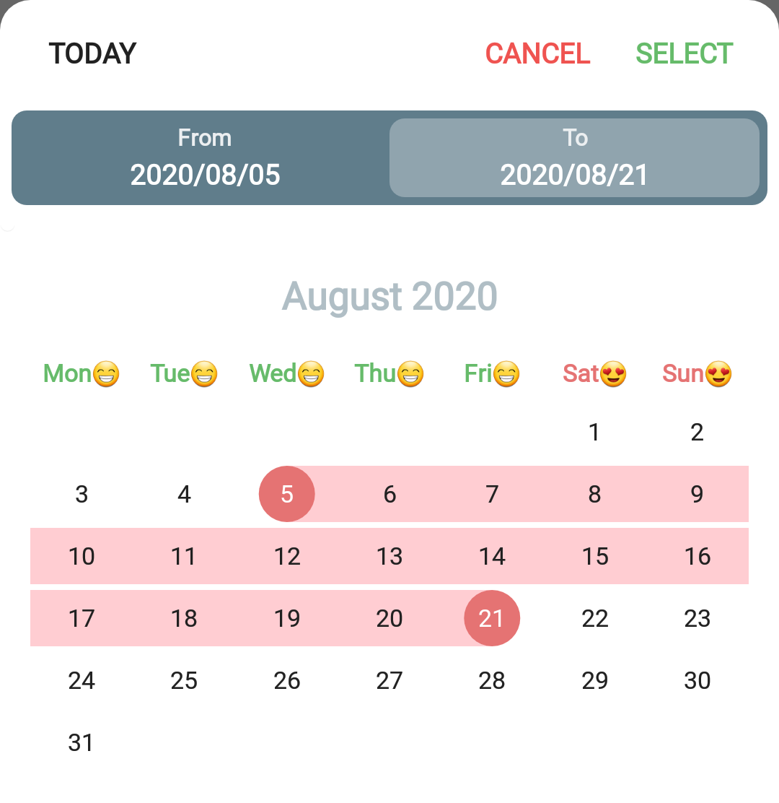

# `PrimeDatePicker` :zap:
[](https://android-arsenal.com/details/1/7743)
[](http://androidweekly.net/issues/issue-367)
[](https://bintray.com/aminography/maven/PrimeDatePicker/_latestVersion)
[](https://app.codacy.com/manual/aminography/PrimeDatePicker?utm_source=github.com&utm_medium=referral&utm_content=aminography/PrimeDatePicker&utm_campaign=Badge_Grade_Dashboard)
[](https://android-arsenal.com/api?level=13)

Firstly, **`PrimeDatePicker`** is a tool that provides picking a single day, multiple days, and a range of days. Secondly, you can use internal elements like `MonthView` and `CalendarView` as stand-alone views in your projects.


<table>

  <tr>
    <td><b>Picking Multiple Days</b><br/><i>Example for Civil</i></td>
    <td><b>Picking a Range of Days</b><br/><i>Example for Persian</i></td>
    <td><b>Picking a Single Day</b><br/><i>Example for Hijri</i></td>
    <td><b>Goto View</b><br/><i>Example for Japanese</i></td>
  </tr>

  <tr>
    <td></td>
    <td></td>
    <td></td>
    <td></td>
  </tr>

</table>

<br/>

Core Logic
----------
The ❤️ of this library is provided by [**PrimeCalendar**](https://github.com/aminography/PrimeCalendar).

<br/>

Main Characteristics
--------------------
- Endless Scrolling
- Fully Customizable Views & Themes
- Align With Material Design
- Fluent UI
- RTL Support
- Landscape Support
- Various Calendar Types
- Various Date Picking Strategies
- Dialog & BottomSheet Presentations
- Fast Goto

#### :dart: Download [SampleApp.apk](https://github.com/aminography/PrimeDatePicker/releases/download/v3.1.1/sample-app-release.apk)

<br/>

Download
--------
**`PrimeDatePicker`** is available on [bintray](https://bintray.com/aminography/maven/PrimeDatePicker) to download using build tools systems. Add the following lines to your `build.gradle` file:

```gradle
repositories {
    jcenter()
}
  
dependencies {
    implementation 'com.aminography:primedatepicker:3.3.1'
    implementation 'com.aminography:primecalendar:1.3.2'
}
```

<br/>

Usage
-----------------
To enjoy `PrimeDatePicker`, create an instance using a builder pattern, like the following snippets:

> Kotlin
```kotlin

val callback = MultipleDaysPickCallback { multipleDays ->
    // TODO
}

val themeFactory = DarkThemeFactory()

val today = CivilCalendar()  // To show a date picker with Civil dates, also today as the starting date

val datePicker = PrimeDatePicker.bottomSheetWith(today)  // or dialogWith(today)
        .pickMultipleDays(callback)        // Passing callback is optional, can be set later using setDayPickCallback()
        .minPossibleDate(minDateCalendar)  // Optional
        .maxPossibleDate(maxDateCalendar)  // Optional
        .disabledDays(disabledDaysList)    // Optional
        .firstDayOfWeek(Calendar.MONDAY)   // Optional
        .applyTheme(themeFactory)          // Optional
        .build()

datePicker.show(supportFragmentManager, "SOME_TAG")
```

<br/>

> Java
```java
SingleDayPickCallback callback = new SingleDayPickCallback() {
    @Override
    public void onSingleDayPicked(PrimeCalendar singleDay) {
        // TODO
    }
};

BaseThemeFactory themeFactory = new LightThemeFactory();

PrimeCalendar today = new JapaneseCalendar();  // To show a date picker with Japanese dates, also today as the starting date

PrimeDatePicker datePicker = PrimeDatePicker.Companion.dialogWith(today)  // or bottomSheetWith(today)
    .pickSingleDay(callback)           // Passing callback is optional, can be set later using setDayPickCallback()
    .minPossibleDate(minDateCalendar)  // Optional
    .maxPossibleDate(maxDateCalendar)  // Optional
    .disabledDays(disabledDaysList)    // Optional
    .firstDayOfWeek(Calendar.MONDAY)   // Optional
    .applyTheme(themeFactory)          // Optional
    .build();

datePicker.show(getSupportFragmentManager(), "SOME_TAG");
```

<br/>

### Configurations Based on Input Calendar

`PrimeDatePicker` reads some configurations from the input calendar, so they are reflected to the date picker. For example:

```kotlin
// shows a Persian calendar, but in English language which leads to LTR direction
val calendar = PersianCalendar(Locale.ENGLISH).also {
    it.year = 1398                       // customizes starting year
    it.month = 7                         // customizes starting month
    it.firstDayOfWeek = Calendar.MONDAY  // sets first day of week to Monday
}

val datePicker = PrimeDatePicker.bottomSheetWith(calendar)
                    .pickSingleDay(callback)
                     ...
                    .build()
```

<br/>

### Customizing Theme

`PrimeDatePicker` is fully customizable and you can tailor it to what you desire.
Almost everything is customizable. For example:
- text sizes & colors
- background & element colors
- padding & distances
- font typeface
- string formatter
- calendar animations & transition parameters
- *etc*

In this way, a set of theme factory class are provided to specify theme parameters.
By default, there are two concrete subclasses for the them factory:

- [`DarkThemeFactory`](library/src/main/java/com/aminography/primedatepicker/picker/theme/DarkThemeFactory.kt)
- [`LightThemeFactory`](library/src/main/java/com/aminography/primedatepicker/picker/theme/LightThemeFactory.kt)

You can override their parameters, or inherit a class from, or make your own theme factory.

Here is an example of how to override theme parameters in `Kotlin` as well as `Java`:

> Kotlin
```kotlin
val themeFactory = object : LightThemeFactory() {

    override val typefacePath: String?
        get() = "fonts/Roboto-Regular.ttf"
        
    override val calendarViewPickedDayInRangeBackgroundColor: Int
        get() = getColor(R.color.red100)

    override val calendarViewPickedDayInRangeLabelTextColor: Int
        get() = getColor(R.color.gray900)

    override val calendarViewWeekLabelFormatter: LabelFormatter
        get() = { primeCalendar ->
            when (primeCalendar[Calendar.DAY_OF_WEEK]) {
                Calendar.SATURDAY,
                Calendar.SUNDAY -> String.format("%s😍", primeCalendar.weekDayNameShort)
                else -> String.format("%s😁", primeCalendar.weekDayNameShort)
            }
        }

    override val calendarViewWeekLabelTextColors: SparseIntArray
        get() = SparseIntArray(7).apply {
            val red = getColor(R.color.red300)
            val green = getColor(R.color.green400)
            put(Calendar.SATURDAY, red)
            put(Calendar.SUNDAY, red)
            put(Calendar.MONDAY, green)
            put(Calendar.TUESDAY, green)
            put(Calendar.WEDNESDAY, green)
            put(Calendar.THURSDAY, green)
            put(Calendar.FRIDAY, green)
        }
        
     // Other customizations...
}
```

<table>

  <tr>
    <td><b>Result:</b></td>
  </tr>

  <tr>
    <td></td>
  </tr>

</table>

> Java
```java
BaseThemeFactory themeFactory = new LightThemeFactory() {
    
    @NotNull
    @Override
    public PrimeCalendarView.FlingOrientation getCalendarViewFlingOrientation() {
        return PrimeCalendarView.FlingOrientation.HORIZONTAL;
    }
    
    @Override
    public int getSelectionBarBackgroundColor() {
        return super.getColor(R.color.green300);
    }
    
    // Other customizations...
};
```

<br/>

### Customizing Texts

If you want to change some texts in `PrimeDatePicker`, such as a button text, the current solution is to
define some strings in your project's `strings.xml` with equal name defined in the library's `strings.xml`, to override them.

<br/>
<hr/>

Stand-Alone Views
-----------------

To see how to use **`PrimeMonthView`** & **`PrimeCalendarView`**, [refer to wiki page](wiki#stand-alone-views) .

Change Log
----------
### Version 3.3.1
- Ability to specify only from date initially when picking range.

### Version 3.3.0
- Handling hardware acceleration issue.

### Version 3.2.2
- Improving Arabic digits.

### Version 3.2.0
- Ability to show adjacent months' days in the current month (using `showAdjacentMonthDays`) and customize their text color.
- Ability to change the background shape of the selected days (using `pickedDayBackgroundShapeType` and `pickedDayRoundSquareCornerRadius`).
- Minor improvements.

### Version 3.1.1
- Some UI adjustments.

### Version 3.1.0
- Adding ability to change background and text color of days in selected range.
- Improvement in japanese text and temporal names.
- Minor bug fixed.

### Version 3.0.4
- A minor bug fixed.

### Version 3.0.0
- Builder mechanism has changed a bit.
- Adding full customization ability using a user configurable theme factory.
- Ability to show the date picker as a dialog using `PrimeDatePicker.dialogWith` method as well as `PrimeDatePicker.bottomSheetWith` to show a bottom sheet.
- Ability to specify a list of disabled days.

### Version 2.0.0
- Builder mechanism has changed.
- Picking multiple days has better UX.
- Adding Goto by tapping on Month-Year.
- Picking animation has improved.
- Possibility to change start day of week.
- Adding RTL support in bottom sheet.```

### Version 1.1.0
- Migrated to AndroidX

### Version 1.0.16
- Ability to pick multiple days using `MULTIPLE` <a href="library/src/main/java/com/aminography/primedatepicker/common/PickType.kt">PickType</a>.

### Version 1.0.15
- A minor bug is fixed.

### Version 1.0.14
- Animation for selected days using `animateSelection`, `animationDuration`, and `animationInterpolator` attributes.

<br/>

License
--------
```
Copyright 2019 Mohammad Amin Hassani.

Licensed under the Apache License, Version 2.0 (the "License");
you may not use this file except in compliance with the License.
You may obtain a copy of the License at

   http://www.apache.org/licenses/LICENSE-2.0

Unless required by applicable law or agreed to in writing, software
distributed under the License is distributed on an "AS IS" BASIS,
WITHOUT WARRANTIES OR CONDITIONS OF ANY KIND, either express or implied.
See the License for the specific language governing permissions and
limitations under the License.
```
